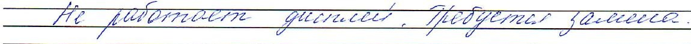

Телефон: 8 (831) 267-12-95; 8 (800) 200-32-68

AKT OT «162slaf 2025.

## проверки прибора учета электроэнергии

Составитель акта:4p 

Должность: инженер 2 категбрииотдела Энергоинспекции

Потребитель:ПтСеn/c N had D1E 34S4/L 

Адрес пользования электроэнергией:2yp KoiimreinppNnlj 

Контактный телефон:89.20-016-75D5

Причина составления акта: проверка прибора учета электроэнергии (счетчика).

Данные прибора учета (счетчика):

<html><body><table border="1"><tr><td>Тип</td><td rowspan="2">Разрядность</td><td rowspan="2">Кlасс точноС ТИ</td><td>Вольт</td><td rowspan="2">Место установки</td><td rowspan="2">Дата гос. поверки</td><td rowspan="2">Принадлеж HOCTь</td><td rowspan="2">Показания</td></tr><tr><td>заводской номер</td><td>Ампер</td></tr><tr><td>ham 2</td><td rowspan="3"></td><td rowspan="3">d</td><td>dd0</td><td rowspan="3">kbapmupe</td><td rowspan="3">11.06.14</td><td rowspan="3">cO</td><td>X1265</td></tr><tr><td>63624-16</td><td>a9g</td><td>2916</td></tr><tr><td></td><td></td><td></td><td></td></tr></table></body></html>

## Техническое состояние узла учета электроэнергии после проверки и заключение:

1. В ходе проверки прибора учета установлено:

<html><body><table border="1"><tr><td>No</td><td>Наименование требований к расчетному узлу учета электроэнергии</td><td>Соответствие***)</td></tr><tr><td>1</td><td>Соответствие пломб гос. поверителя на счетчике (пуэ гл. 1.5.13)</td><td>Соответствует / Не соответствует</td></tr><tr><td>2</td><td>Наличие пломбы энергоснабжающей организации - ЭСО (ПУэ гл. 1.5.13)</td><td>Есть /Нет</td></tr><tr><td>3</td><td>Соответствие класса точности счетчика (ПУЭ гл. 1.5.15)</td><td>Соответствует / Не соответствует</td></tr><tr><td>4</td><td>Соответствие включения счетчика по схеме</td><td>Соответствует / Не соответствует</td></tr><tr><td>5</td><td>момент составления данного акта.</td><td>Соответствует/Не соответствует</td></tr><tr><td>6</td><td>Соответствие времени на внутренних часах счетчика с временем, установленным в   </td><td>Соответствует / Не соответствует</td></tr></table></body></html>

е ож..

### 2. випедофнивенфтиноо

